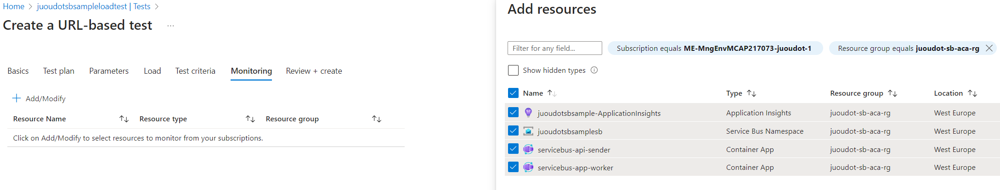

# Introduction
This project is composed of 3 main components:
- An ASP.NET Core API that will send/write message into two Service Bus Queues: 1 that will be read by jobs started in Container Apps (i.e. 1 job per message), 1 that will be read by a worker that keeps on reading new messages in a loop
- A Console application that will read messages in a loop. This is meant to be hosted as a Container App App
- A Console application that will read a single message. This is meant to be hosted as a Container App Job

# Local Testing
To test local container image, run the following command from the root folder (Linux Container): 
```
docker build -t demo-sb-processor:1.0 -f ./Dockerfile.job .
```

```
docker build -t demo-sb-worker:1.0 -f ./Dockerfile.worker .
```
```
docker build -t demo-sb-writer:1.0 -f ./Dockerfile.api .
```
Then, you can test the run step. It should fail saying connection strings are invalid unless you set the right env variable (not recommended in Dockerfile)
```
docker run -d demo-sb-processor:1.0
```
```
docker run -d demo-sb-worker:1.0
```
```
docker run -d -p 8080:9000 demo-sb-writer:1.0
```
# Cloud Deployment
Deploy resources.biceps file to make sure the supporting infrastructure exist(e.g. the container registry, container app environment, ...) 
```
az group create --name juoudot-sb-aca-rg --location "West Europe"
```

Tag the Container image before pushing it to the container registry
```
docker tag demo-sb-processor:1.0 juoudotsbsampleacr.azurecr.io/demo-sb-processor:1.0
```
```
docker tag demo-sb-worker:1.0 juoudotsbsampleacr.azurecr.io/demo-sb-worker:1.0
```
```
docker tag demo-sb-writer:1.0 juoudotsbsampleacr.azurecr.io/demo-sb-writer:1.0
```

```
az deployment group create --name joudot-deployment --resource-group juoudot-sb-aca-rg --template-file .\Deploy\resources.bicep
```
Push the container previously tagged
```
docker login juoudotsbsampleacr.azurecr.io -u juoudotsbsampleacr
```
```
docker push juoudotsbsampleacr.azurecr.io/demo-sb-processor:1.0
```
```
docker push juoudotsbsampleacr.azurecr.io/demo-sb-worker:1.0
```
```
docker push juoudotsbsampleacr.azurecr.io/demo-sb-writer:1.0
```
Finally deploy the container App job with the below command
```
az deployment group create --name joudot-deployment --resource-group juoudot-sb-aca-rg --template-file .\Deploy\main.bicep --parameters imageTag=1.0
```

# Testing/Validation
Test API by calling the endpoint: 
Go to Container Apps URL (e.g. https://servicebus-api-sender.proudbeach-b4b4a7cc.westeurope.azurecontainerapps.io/swagger/index.html) and try calling the API targeting one of the queues (read by the Container App Job or the container App)

# (Optional) Configure a basic Load Testing 
From the Azure Load Test enironment, create a new URL based test


Then, make sure you add the right resources to monitor during the load testing


# Cleaning
Cleaning 
> az group delete --name juoudot-sb-aca-rg